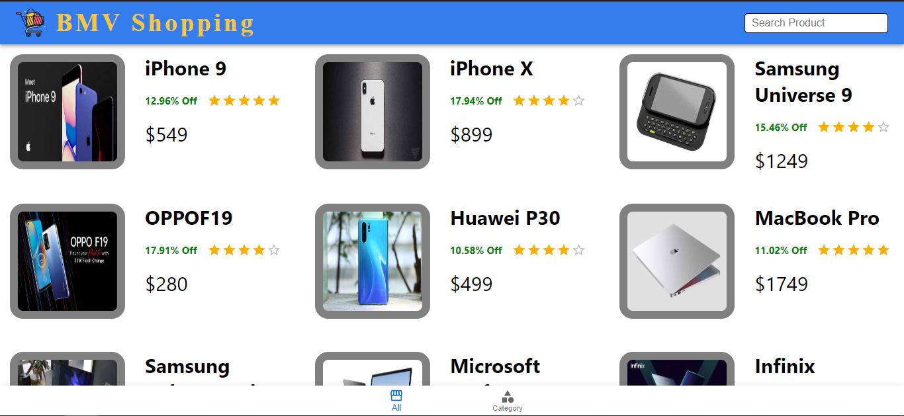
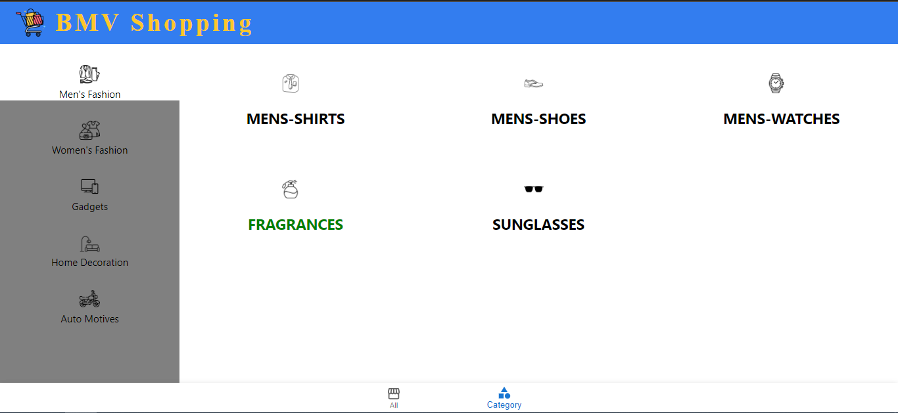
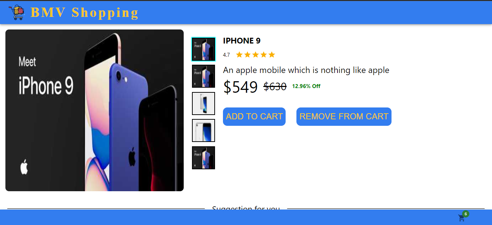
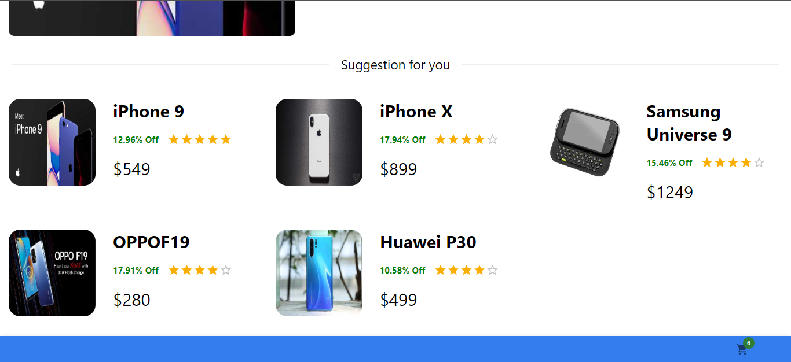

## React Shopping app

## Overview
  - This is a simple Shopping Application.

## Features
  - Add to cart.
  - Remove to cart.
  - View full specification of product.
  - Add suggestion part.
  - Sort products by category.
  - Checkout functionality.

## Technologies Used
  - React
  - Material ui
  - For API, We use dummyjson.com website.

## Getting Started
  - Clone the repository: <code>git clone git@github.com:systemintegration/react-js-shopping.git</code>
  - Install dependencies: <code>npm install</code>
  - Start the development server: <code>npm start</code>

## Contributing
  - Contributions are welcome! To contribute to the project, follow these steps:
    - Fork the repository
    - Create a new branch: <code>git checkout -b my-feature-branch</code>
    - Make your changes and commit them: <code>git commit -am 'Add some feature'</code>
    - Push your changes to your branch: <code>git push origin my-feature-branch</code>
    - Create a new pull request and explain your changes
In the project directory, you can run:

## Screenshots
    -Main UI

    -Category Page

    -Product detail

    -Suggestion page

    -Cart Page

## Demo
   - You can try out the application at <a href="https://systemintegration.github.io/react-js-shopping">https://systemintegration.github.io/react-js-shopping</a>
